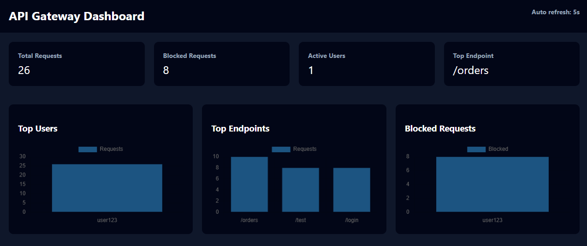
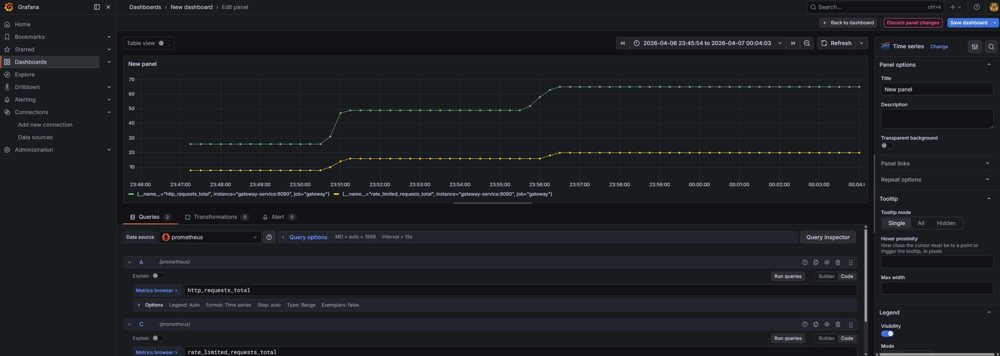

# Distributed API Gateway with Rate Limiting, Analytics & Auto-Scaling

## 📖 Overview

This project is a **production-style distributed API Gateway** built using:

* **Go (Golang)** → High-performance API layer
* **Redis** → Rate limiting + event streaming  
* **MySQL** → Persistent analytics storage
* **Kubernetes (Minikube)** → Container orchestration
* **Prometheus + Grafana** → Monitoring & visualization

### What This System Does

* Enforces **rate limiting per API key** using sliding window algorithm
* Logs requests asynchronously using **Redis Streams**
* Processes logs using a dedicated **worker service**
* Stores analytics in **MySQL** for reporting
* Displays insights via a **web dashboard** (Chart.js)
* Auto-scales using **Kubernetes HPA (Horizontal Pod Autoscaler)**
* Provides metrics for **Prometheus** scraping

---

## 📋 Prerequisites (MUST INSTALL FIRST)

Before starting, ensure you have these installed on your machine:

### Required Software

| Tool | Version | Download |
|------|---------|----------|
| **Docker Desktop** | Latest | https://www.docker.com/products/docker-desktop |
| **kubectl** | v1.24+ | https://kubernetes.io/docs/tasks/tools/ |
| **Minikube** | Latest | https://minikube.sigs.k8s.io/docs/start/ |
| **Go** | 1.19+ | https://golang.org/dl |
| **Git** | Latest | https://git-scm.com |

### Verify Installations

```bash
docker --version
kubectl version --client
minikube version
go version
git --version
```

Expected output:
```
Docker version 24.0.x
Client Version: v1.28.x
minikube version: v1.30.x
go version go1.21.x
git version 2.40.x
```

---

## ⚡ Quick Start (Choose One)

### Option 1: Docker Compose (⭐ EASIEST - 3 minutes)

Perfect for development and testing locally without Kubernetes.

```bash
# Step 1: Navigate to project
cd api-gateway-rate-limiter

# Step 2: Create .env file in project root
cat > .env << EOF
MYSQL_ROOT_PASSWORD=rootpassword
DB_USER=root
DB_PASS=rootpassword
DB_HOST=mysql
DB_NAME=api_gateway_analytics
REDIS_ADDR=redis:6379
EOF

# Step 3: Start all services
docker compose up --build

# Wait for all containers to start (last line should say "Gateway started on port 8080")

# Step 4: Access services in browser
# Gateway Dashboard: http://localhost:8080/dashboard
# Gateway Health:   http://localhost:8080/health
# Metrics:          http://localhost:8080/metrics
```

**Services Running:**
- API Gateway: `http://localhost:8080`
- MySQL: `localhost:3306`
- Redis: `localhost:6379`



---

### Option 2: Kubernetes + Minikube (⭐ RECOMMENDED - Full production setup)

Complete setup with auto-scaling, monitoring, and proper namespace isolation.

#### Step 1: Start Minikube Cluster

```bash
minikube start --cpus=4 --memory=4096
# Wait for cluster to start (should say "Done!")
```

#### Step 2: Switch to Minikube's Docker Environment

**Windows (PowerShell):**
```powershell
minikube docker-env | Invoke-Expression
```

**Mac/Linux (Bash):**
```bash
eval $(minikube docker-env)
```

This makes your local Docker build directly on Minikube, avoiding image push/pull.

#### Step 3: Build Docker Images

```bash
# Build gateway image
docker build -t rate-limiter-gateway ./rate-limiter-api

# Build worker image
docker build -t rate-limiter-worker ./analytics-worker

# Verify images are built
docker images | grep rate-limiter
```

#### Step 4: Create Kubernetes Namespace

```bash
kubectl create namespace rate-limiter
```

⚠️ **IMPORTANT:** All resources MUST be in `rate-limiter` namespace, not `default`

#### Step 5: Create Secrets for Database

```bash
kubectl create secret generic gateway-secret \
  --from-literal=DB_USER=root \
  --from-literal=DB_PASS=rootpassword \
  -n rate-limiter
```

Verify:
```bash
kubectl get secrets -n rate-limiter
```

#### Step 6: Apply All Kubernetes Manifests

```bash
# Apply everything from k8s directory
kubectl apply -f k8s/ -n rate-limiter

# Verify resources are created
kubectl get all -n rate-limiter
```

#### Step 7: Wait for All Pods to Be Ready

```bash
# Watch pods starting up
kubectl get pods -n rate-limiter -w

# Expected output:
# NAME                                  READY   STATUS    RESTARTS   AGE
# gateway-deployment-xxxxxx-xxxxx       1/1     Running   0          20s
# mysql-xxxxxx-xxxxx                    1/1     Running   0          25s
# redis-xxxxxx-xxxxx                    1/1     Running   0          25s
# grafana-xxxxxx-xxxxx                  1/1     Running   0          20s
# prometheus-xxxxxx-xxxxx               1/1     Running   0          20s
# worker-xxxxxx-xxxxx                   1/1     Running   0          20s

# Press Ctrl+C to exit watch mode
```

**⏰ First startup takes 1-2 minutes (MySQL initializing)**

#### Step 8: Set Up Port Forwarding

Open multiple terminals and run these (one per terminal):

**Terminal 1 - Gateway (API & Dashboard):**
```bash
kubectl port-forward -n rate-limiter svc/gateway-service 8080:8080
```

**Terminal 2 - Grafana Monitoring:**
```bash
kubectl port-forward -n rate-limiter svc/grafana-service 3000:3000
```


**Terminal 3 - Prometheus Metrics:**
```bash
kubectl port-forward -n rate-limiter svc/prometheus-service 9090:9090
```

#### Step 9: Access All Services

Open in browser:

| Service | URL | Purpose |
|---------|-----|---------|
| **Gateway** | http://localhost:8080/health | Health check |
| **Dashboard** | http://localhost:8080/dashboard | Analytics dashboard |
| **Metrics** | http://localhost:8080/metrics | Prometheus metrics |
| **Grafana** | http://localhost:3000 | Grafana dashboards |
| **Prometheus** | http://localhost:9090 | Prometheus UI |

---
## 🧪 Testing the API

### Generate API Key

First, test with a sample API key:

```bash
# Health check
curl http://localhost:8080/health

# Make a request with API key
curl -H "x-api-key: user123" http://localhost:8080/test

curl -H "x-api-key: user123" http://localhost:8080/orders

curl -H "x-api-key: user123" http://localhost:8080/login
```

### Generate Test Traffic (for rate limiting)

```bash
# This will hit the rate limit (default: 5 requests per 60s)
for i in {1..10}; do 
  curl -H "x-api-key: testuser" http://localhost:8080/test
  echo "Request $i"
  sleep 0.5
done
```

### View Analytics

```bash
# Top users by requests
curl http://localhost:8080/analytics/top-users

# Top endpoints
curl http://localhost:8080/analytics/top-endpoints

# Blocked requests (rate limited)
curl http://localhost:8080/analytics/blocked-requests
```

---

## 🏗️ Project Structure

```
api-gateway-rate-limiter/
├── rate-limiter-api/           # Main API Gateway (Go)
│   ├── main.go                 # API server code
│   ├── go.mod                  # Go module dependencies
│   ├── Dockerfile              # Docker image definition
│   └── dashboard/
│       └── index.html          # Web dashboard (Chart.js)
├── analytics-worker/           # Background Worker (Go)
│   ├── main.go                 # Worker code
│   ├── go.mod                  # Dependencies
│   └── Dockerfile              # Worker Docker image
├── k8s/                        # Kubernetes manifests
│   ├── configmap.yaml          # Config (non-sensitive)
│   ├── mysql-deployment.yaml   # MySQL + Service
│   ├── redis-deployment.yaml   # Redis + Service
│   ├── gateway-deployment.yaml # Gateway + Service
│   ├── gateway-service.yaml    # Gateway NodePort
│   ├── worker-deployment.yaml  # Worker service
│   ├── prometheus.yaml         # Prometheus monitoring
│   ├── grafana.yaml           # Grafana dashboards
│   ├── hpa.yaml               # Auto-scaling rules
│   └── metrics-server.yaml    # Metrics collection
├── mysql-init/                # Database initialization
│   └── init.sql               # SQL schema
├── docker-compose.yml         # Local Docker setup
├── nginx.conf                 # NGINX config (if using)
└── README.md                  # This file
```

---

## 🐳 Architecture

### System Flow

```
Client Request
    ↓
API Gateway (Go) - Rate Limiting (Redis)
    ↓
Request allowed? → YES → Forward to endpoint
    ↓                          ↓
    NO                    Process request
    ↓                        ↓
Rate limited             Log to Redis Stream
(408)                         ↓
                        Worker picks up logs
                               ↓
                        Store in MySQL
                               ↓
                        Dashboard displays
```

### Kubernetes Architecture

```
┌────────────────────────────────────────────────┐
│         Kubernetes Cluster (Minikube)          │
│  Namespace: rate-limiter                       │
├────────────────────────────────────────────────┤
│                                                │
│  ┌──────────────────────────────────────┐      │
│  │  Gateway Service (NodePort:30007)    │      │
│  │  ├─ Pod 1 (Gateway)                  │      │
│  │  └─ Pod 2+ (via HPA scaling)         │      │
│  └──────────────────────────────────────┘      │
│           ↓                ↓                   │
│  ┌──────────────┐  ┌──────────────────┐        │
│  │    Redis     │  │  MySQL           │        │
│  │  (Streams)   │  │  (Analytics DB)  │        │
│  └──────────────┘  └──────────────────┘        │
│           ↓                                    │
│  ┌──────────────────────────────────────┐      │
│  │  Worker Pod                          │      │
│  │  (Consumes Redis → Writes MySQL)     │      │
│  └──────────────────────────────────────┘      │
│           ↓                                    │
│  ┌──────────────────────────────────────┐      │
│  │  Monitoring Stack                    │      │
│  │  ├─ Prometheus (Scrapes metrics)     │      │
│  │  └─ Grafana (Visualizes)             │      │
│  └──────────────────────────────────────┘      │
│                                                │
└────────────────────────────────────────────────┘
```

---

## 🔐 Configuration

### Environment Variables (.env or ConfigMap)

```env
# Database
DB_USER=root
DB_PASS=rootpassword
DB_HOST=mysql              # Service name in Kubernetes
DB_NAME=api_gateway_analytics

# Redis
REDIS_ADDR=redis:6379      # Service name in Kubernetes

# Rate Limiting
REQUEST_LIMIT=5            # Max requests per 60s per key
```

### Secrets (Sensitive Data)

Store passwords using Kubernetes Secrets:

```bash
kubectl create secret generic gateway-secret \
  --from-literal=DB_USER=root \
  --from-literal=DB_PASS=rootpassword \
  -n rate-limiter
```

---

## 📊 Monitoring

### Prometheus

Scrapes metrics from `/metrics` endpoint every 5 seconds.

**Query examples in Prometheus UI (http://localhost:9090):**
```promql
# Total HTTP requests
http_requests_total

# Rate limited requests
rate_limited_requests_total

# Pod memory usage
container_memory_usage_bytes

# Pod CPU usage
rate(container_cpu_usage_seconds_total[5m])
```

### Grafana

Dashboards visualize:
- Request count per endpoint
- Rate limiting effectiveness
- Pod resource utilization
- Error rates

**Login:** 
- Default username: `admin`
- Default password: `admin`

---

## 📈 Auto-Scaling (HPA)

The Kubernetes Horizontal Pod Autoscaler (HPA) automatically scales gateway pods based on CPU usage.

**Configuration (hpa.yaml):**
```yaml
minReplicas: 1           # Minimum pods always running
maxReplicas: 3           # Maximum pods to scale up to
targetCPUUtilizationPercentage: 70    # Scale when CPU > 70%
```

**View HPA status:**
```bash
kubectl get hpa -n rate-limiter -w
```

**Force scaling (for testing):**
```bash
# Generate heavy load
for i in {1..100}; do 
  curl -H "x-api-key: user$i" http://localhost:8080/test &
done
wait
```

---

## ❌ Troubleshooting

### Issue 1: Pods in CrashLoopBackOff

**Symptom:** `kubectl get pods` shows pod restarting repeatedly

**Causes & Solutions:**

1. **Missing MySQL Service or wrong namespace:**
   ```bash
   # Check if MySQL service exists in rate-limiter namespace
   kubectl get svc -n rate-limiter
   
   # Make sure DB_HOST in configmap matches service name
   kubectl get configmap -n rate-limiter gateway-config -o yaml
   ```

2. **MySQL not initialized yet:**
   ```bash
   # Wait longer for MySQL to start
   kubectl logs -n rate-limiter -l app=mysql
   ```

3. **Check pod logs:**
   ```bash
   kubectl logs -n rate-limiter <pod-name> --tail=50
   ```

**Fix:**
```bash
# Delete pod to restart
kubectl delete pod -n rate-limiter <pod-name>

# Or restart entire deployment
kubectl rollout restart deployment/gateway-deployment -n rate-limiter
```

### Issue 2: Gateway Can't Connect to MySQL

**Symptom:** Logs show `"Waiting for MySQL... attempt X"`

**Solution:**
```bash
# Check DB_HOST is "mysql" not "mysql:3306"
kubectl get configmap -n rate-limiter gateway-config -o yaml

# Should show: DB_HOST: "mysql" (not mysql:3306)
# Port is separate - 3306 is the container port
```

### Issue 3: Services in Wrong Namespace

**Symptom:** `kubectl get svc` shows services in `default` instead of `rate-limiter`

**Solution:**
```bash
# Check all namespaces
kubectl get svc -A

# Delete service from default
kubectl delete svc <service-name>

# Verify all k8s manifests have namespace: rate-limiter in metadata
grep -r "namespace:" k8s/
```

### Issue 4: Port-Forward Not Working

**Symptom:** `kubectl port-forward` command fails

**Solution:**
```bash
# Check if pod is actually running
kubectl get pods -n rate-limiter

# Check pod details
kubectl describe pod -n rate-limiter <pod-name>

# Try different port
kubectl port-forward -n rate-limiter svc/gateway-service 9000:8080
# Then access: http://localhost:9000
```

### Issue 5: Docker Images Not Built

**Symptom:** `ImagePullBackOff` error in pod description

**Solution:**
```bash
# Ensure Minikube docker environment is set
minikube docker-env | Invoke-Expression  # Windows PowerShell

# Build images
docker build -t rate-limiter-gateway ./rate-limiter-api
docker build -t rate-limiter-worker ./analytics-worker

# Verify images exist
docker images | grep rate-limiter

# Update imagePullPolicy to Never in deployments
# (Already done in manifests)
```

### Issue 6: Dashboard Shows No Data

**Symptom:** Dashboard page loads but no charts

**Solution:**
```bash
# Generate test traffic
for i in {1..20}; do 
  curl -H "x-api-key: user123" http://localhost:8080/test
done

# Wait 10 seconds for worker to process

# Check dashboard again
```

---

## 🔬 API Endpoints

### Gateway Routes

```bash
# Health Check
GET /health
Response: "OK"

# Test Endpoint (rate limited)
GET /test
Headers: x-api-key: your-key
Rate Limit: 5 req/60s

# Orders Endpoint
GET /orders
Headers: x-api-key: your-key
Rate Limit: 10 req/60s

# Login Endpoint
GET /login
Headers: x-api-key: your-key
Rate Limit: 3 req/60s

# Metrics (Prometheus format)
GET /metrics

# Dashboard
GET /dashboard/
UI: Web interface with charts
```

### Analytics Endpoints

```bash
# Top users by request count
GET /analytics/top-users
Response: JSON list of users

# Top endpoints
GET /analytics/top-endpoints
Response: JSON list of endpoints

# Blocked requests (rate limited)
GET /analytics/blocked-requests
Response: JSON list of blocked requests
```

---

## 📊 Monitoring
---

## Features Implemented

* ✅ Sliding window rate limiting (Redis)
* ✅ Per-user + per-endpoint limits
* ✅ Async logging (Redis Streams)
* ✅ Worker-based processing
* ✅ MySQL analytics
* ✅ Dashboard (Chart.js)
* ✅ Dockerized system
* ✅ Kubernetes deployment
* ✅ Horizontal Pod Autoscaling (HPA)
* ✅ Prometheus metrics
* ✅ Grafana dashboards
* ✅ Secrets + ConfigMaps
* ✅ Proper namespace isolation (rate-limiter)
* ✅ Fixed DB_HOST configuration
* ✅ Extended startup probes for MySQL initialization

---

## 🚀 Deployment Checklist

Before going to production:

- [ ] Database credentials in Kubernetes Secrets, not ConfigMap
- [ ] Resource requests/limits set for HPA
- [ ] Liveness and readiness probes configured
- [ ] All pods in correct namespace (`rate-limiter`)
- [ ] Prometheus and Grafana running
- [ ] Test data generated and visible in dashboard
- [ ] Rate limiting tested and working
- [ ] Auto-scaling tested under load
- [ ] All services accessible via port-forwarding
- [ ] Logs checked for errors: `kubectl logs -f -n rate-limiter <pod>`

---

## 📝 Common Commands

```bash
# Cluster Management
minikube start                           # Start cluster
minikube stop                            # Stop cluster
minikube delete                          # Delete cluster
minikube dashboard                       # Open web dashboard

# Kubernetes Operations
kubectl get pods -n rate-limiter                    # List pods
kubectl get svc -n rate-limiter                     # List services
kubectl get all -n rate-limiter                     # List all resources
kubectl logs -n rate-limiter -l app=gateway        # View gateway logs
kubectl exec -it -n rate-limiter <pod> /bin/bash   # SSH into pod
kubectl delete pod -n rate-limiter <pod>           # Restart pod
kubectl port-forward -n rate-limiter svc/gateway-service 8080:8080  # Port forward

# Docker Commands
docker build -t image-name .           # Build image
docker ps                              # List running containers
docker logs <container>                # View container logs
docker exec -it <container> bash       # SSH into container

# Cleanup
kubectl delete all --all -n rate-limiter           # Delete all in namespace
docker system prune                                # Clean up Docker
```

---

## ✨ Recent Fixes & Updates

### Fixed Issues:
1. **CrashLoopBackOff**: Extended startup probe timeouts and added failureThreshold
2. **Database Connection**: Fixed DB_HOST from `mysql:3306` to `mysql`
3. **Namespace Issues**: All resources now correctly in `rate-limiter` namespace
4. **Service Discovery**: Added `namespace: rate-limiter` to all service manifests
5. **MySQL Initialization**: Added startup probe to MySQL container

### Key Changes Made:
- gateway-deployment.yaml: Extended startupProbe (60s, failureThreshold: 20)
- configmap.yaml: DB_HOST set to "mysql" (not "mysql:3306")
- mysql-deployment.yaml: Added startup probe + namespace to service
- redis-deployment.yaml: Added namespace to service
- prometheus.yaml: Added namespace to deployment and service
- grafana.yaml: Added namespace to service

---

## 🎓 Learning Resources

- [Go HTTP Handler](https://golang.org/pkg/net/http/)
- [Redis Streams](https://redis.io/topics/streams)
- [Kubernetes Services](https://kubernetes.io/docs/concepts/services-networking/)
- [Kubernetes Namespaces](https://kubernetes.io/docs/concepts/overview/working-with-objects/namespaces/)
- [Prometheus Metrics](https://prometheus.io/docs/concepts/metric_types/)
- [Kubernetes HPA](https://kubernetes.io/docs/tasks/run-application/horizontal-pod-autoscale/)
- [Docker Best Practices](https://docs.docker.com/develop/dev-best-practices/)

---

## If you encounter issues:

1. **Check logs first:** `kubectl logs -n rate-limiter -f <pod-name>`
2. **Check pod status:** `kubectl describe pod -n rate-limiter <pod-name>`
3. **Check all resources:** `kubectl get all -n rate-limiter`
4. **Verify configuration:** `kubectl get configmap,secrets -n rate-limiter`
5. **Check Docker images:** `docker images | grep rate-limiter`

---

## 📄 License

MIT License - Feel free to use and modify

---

**Happy Coding! 🚀**
